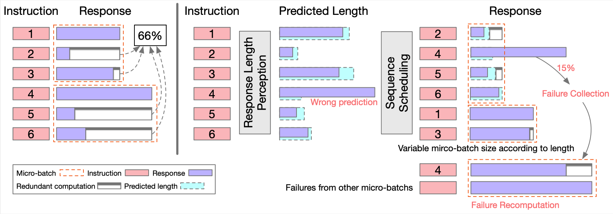
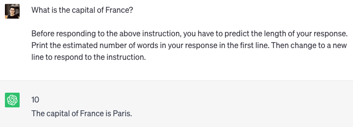
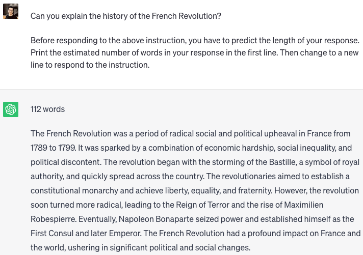

<div align="center">

# Response Length Perception & Sequence Scheduling

</div>

## Description

PyTorch implementation of paper "[Response Length Perception and Sequence Scheduling: An LLM-Empowered LLM Inference Pipeline](https://arxiv.org/abs/2305.13144)".



We find that large language models (LLMs) have the remarkable ability to **perceive the length of their generated responses in advance**. Leveraging this LLM ability, we propose a novel technique called **Sequence Scheduling** to improve the efficiency of LLM batch inference. By grouping queries with similar perceived response lengths together, we significantly reduce redundant computations and achieve an impressive **86%** improvement in inference throughput without compromising performance.

## Perception in Advance (PiA)

Perception in advance asks LLM to perceive the length of the response in advance. LLMs (e.g. ChatGPT) have the ability to conduct this task.



Perceived length: 10, real length: 6.



Perceived length: 112, real length: 119.

## Requirement

1. Install the required packages.

   ```bash
   pip install -r requirements.txt
   ```

2. Get the original LLaMA weights in the Hugging Face format by following the instructions [here](https://huggingface.co/docs/transformers/main/model_doc/llama).
3. Get the Vicuna-7B weights by following the instructions [here](https://github.com/lm-sys/FastChat#vicuna-7b)

   ```bash
   python3 -m fastchat.model.apply_delta \
   --base-model-path ./ckpts/llama-7b \
   --target-model-path ./ckpts/vicuna-7b \
   --delta-path lmsys/vicuna-7b-delta-v1.1
   ```

## Response Length Perception

1. (Optional) Data Preparation: use the following command to generate `alpaca-train-10k.json` and `alpaca-val-10k.json`, or use the data in `data` folder directly.

   ```bash
   python3 -m src.sample
   ```

2. (Optional) Collect the training dataset: first, use the following command to perform multiple inference for the training dataset, or use `alpaca-train-10k-length.json` directly.

   ```bash
   CUDA_VISIBLE_DEVICES=0 python -m src.lenpred
   ```

   Then, use the following command to construct the training dataset for instruction tunning, or use `alpaca-train-10k-instruct.json` directly.

   ```bash
   python3 -m src.construct
   ```

3. Instruction Tunning: use the following command to perform instruction tunning.

   ```bash
   bash train.sh
   ```

   or you can download the LoRA weight from huggingface [ckpts/vicuna-response-length-perception-module](https://huggingface.co/zangwei/vicuna-response-length-perception-module).

   ```bash
   git clone https://huggingface.co/zangwei/vicuna-response-length-perception-module ckpts/vicuna-response-length-perception-module
   ```

4. (Optional) Evaluation: use the following command to evaluate the length perception performance.

   ```bash
   CUDA_VISIBLE_DEVICES=0 python3 -m src.eval
   ```

   - Error: 62
   - Acc-50: 59%
   - Acc-100: 81%

## Sequence Scheduling

Run following commands to benchmark different inference strategy.

- Vanilla: no scheduling.
  - Throughput: 1.39 samples/s
  - Average length: 370.84 tokens
  - Effective token ratio: 33.91%

```bash
CUDA_VISIBLE_DEVICES=0 python -m src.benchmark --num-data 1024
```

- Sequence scheduling: with the instruction-tuned response length perception module, and VBS and FCR strategy.
  - Throughput: 2.30 samples/s
  - Average length: 215.06 tokens
  - Effective token ratio: 47.22%
  - FCR ratio: 16.50 %

```bash
CUDA_VISIBLE_DEVICES=0 python -m src.benchmark --num-data 1024 --strategy seqsch --vbs --fcr --lora-path ./ckpts/vicuna-response-length-perception-module
```

- Sequence scheduling: with the instruction-tuned response length perception module, without VBS and FCR strategy.
  - Throughput: 1.64 samples/s
  - Average length: 297.48 tokens
  - Effective token ratio: 42.17 %

```bash
CUDA_VISIBLE_DEVICES=0 python -m src.benchmark --num-data 1024 --strategy seqsch --lora-path ./ckpts/vicuna-response-length-perception-module
```

- Sequence scheduling: with Perception Only for length prediction. VBS and FCR degrade the performance so we do not use them here.
  - Throughput: 1.32 samples/s
  - Average length: 374.83 tokens
  - Effective token ratio: 33.53 %

```bash
CUDA_VISIBLE_DEVICES=0 python -m src.benchmark --num-data 1024 --strategy po
```

- Sequence scheduling: with ground truth as an upper bound of the performance. VBS and FCR are used here.
  - Time: Throughput: 2.69 samples/s
  - Average length: 196.34 tokens
  - Effective token ratio: 61.57 %

```bash
CUDA_VISIBLE_DEVICES=0 python -m src.benchmark --num-data 1024 --strategy gt --vbs --fcr
```

## Citation

```bibtex
@article{zheng2023response,
    title={Response Length Perception and Sequence Scheduling: An LLM-Empowered LLM Inference Pipeline},
    author={Zangwei Zheng and Xiaozhe Ren and Fuzhao Xue and Yang Luo and Xin Jiang and Yang You},
    journal={arXiv preprint arXiv:2305.13144},
    year={2023}
}
```
